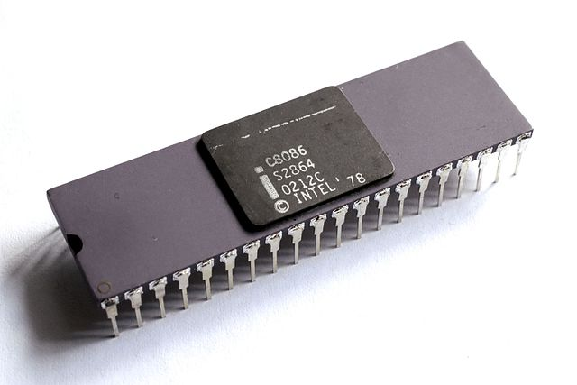

By <a href="https://commons.wikimedia.org/wiki/User:Fouky" title="User:Fouky">Thomas Nguyen</a> - <a rel="nofollow" class="external text" href="https://pttn.me/page.php?n=CollectionProcesseurs">Own work</a>, <a href="https://creativecommons.org/licenses/by-sa/4.0" title="Creative Commons Attribution-Share Alike 4.0">CC BY-SA 4.0</a>, <a href="https://commons.wikimedia.org/w/index.php?curid=46809082">Link</a>

# 8086

This is a project that tries to implement the Intel 8086 processor.
